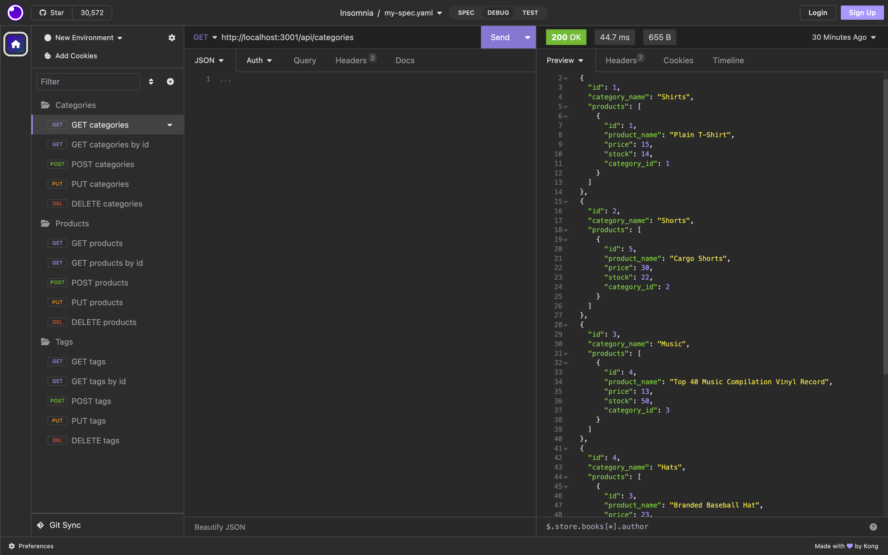

# ORM E-commerce Back End 

## Description

AS A manager at an internet retail company
I WANT a back end for my e-commerce website that uses the latest technologies
SO THAT my company can compete with other e-commerce companies

GIVEN a functional Express.js API
WHEN I add my database name, MySQL username, and MySQL password to an environment variable file
THEN I am able to connect to a database using Sequelize 

This was achieved by uploading this information to a .env file and linking that file to the connection.js file.

WHEN I enter schema and seed commands
THEN a development database is created and is seeded with test data 

Was able to achieve this by entering into mysql and typing 'SOURCE db/schema.sql' and then on an integrated terminal typing 'node seeds/index.js' as the seeded data was defined in a javascript file.

WHEN I enter the command to invoke the application
THEN my server is started and the Sequelize models are synced to the MySQL database 

This was achieved by installing all of the packages and making sure the mysql data from the .env file was accurate.

WHEN I open API GET routes in Insomnia Core for categories, products, or tags
THEN the data for each of these routes is displayed in a formatted JSON 

WHEN I test API POST, PUT, and DELETE routes in Insomnia Core
THEN I am able to successfully create, update, and delete data in my database

This was achived by writing async functions for each method on all three routes that displayed the returned information as json.

## Table of Contents

- [Installation](#installation)

- [Usage](#usage)

- [Questions](#questions)

## Installation

- Step 1: The user will need to have [Node.js](https://nodejs.org/en/download) installed on their PC or use the link provided to install it.

- Step 2: Install mysql on the PC through the Homebrew package manager by typing 'brew install mysql' into the terminal. Additional instructions can be found by following this [link](https://coding-boot-camp.github.io/full-stack/mysql/mysql-installation-guide).

- Step 3: Before running the program the user will need to install the mysql2, dotenv, express, & sequelize packages by typing 'npm install' into the terminal integrated to the location of the folder holding the program, as they are already populated in package.json.

- Step 4: The user will need to create a .env file to store the name of the database as well as their mysql username and password.

- Step 5: Using mysql run 'SOURCE schema.sql' to create the database and in the integrated terminal run 'node seeds/index.js' to seed the newly crested database.

- Step 6: The user will run the program by following the example provided in the [Usage](#usage) section.

## Usage

Video Example: https://watch.screencastify.com/v/jJBuckNFhge6ajsiGRss

## Questions

Regarding any questions please check out my Github profile [JakeHowdeshell](https://github.com/JakeHowdeshell/node.js-readme-generator/tree/main).

Or send me an [email](mailto:Jakehowdy@gmail.com).